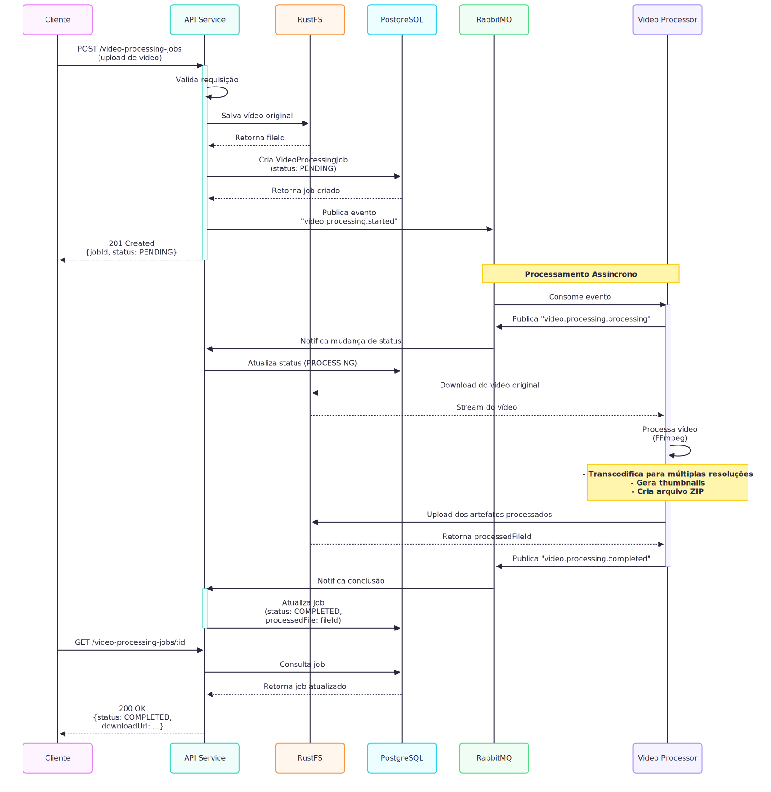

# Documentação de Arquitetura - Sistema de Processamento de Vídeos

## 📋 Sumário

1. [Visão Geral](#visão-geral)
2. [Arquitetura](#arquitetura)
3. [Componentes](#componentes)
4. [Tecnologias](#tecnologias)
5. [Deploy e Infraestrutura](#deploy-e-infraestrutura)
6. [Observabilidade e Performance](#observabilidade-e-performance)

---

## Visão Geral

Plataforma de processamento de vídeos em **monorepo NestJS** seguindo **Clean Architecture** e **DDD**.

**Objetivo:** Upload e processamento assíncrono de vídeos com transcodificação e geração de artefatos.

**Características:**
- Microserviços com comunicação assíncrona (Event-Driven)
- Armazenamento distribuído S3-compatible (RustFS)
- Observabilidade completa (Prometheus + Grafana)
- Deploy containerizado (Docker + Kubernetes)

---

## Arquitetura



**Padrões Aplicados:** Microserviços, Event-Driven, Clean Architecture, Repository Pattern, Dependency Injection

**Fluxo:**
1. Cliente faz upload → API REST (NestJS)
2. API salva no RustFS + cria job no PostgreSQL
3. API publica evento no RabbitMQ
4. Worker consome evento → processa vídeo (FFmpeg)
5. Worker salva artefatos → atualiza status



**Estados do Job:** PENDING → PROCESSING → COMPLETED/FAILED



---

## Componentes

### 1. API Service (Port: 3000)
**Responsabilidades:**
- Endpoints REST para upload/consulta de vídeos
- Validação e autenticação
- Publicação de eventos para processamento

**Responsabilidades:**
- Endpoints REST para upload/consulta de vídeos
- Validação e autenticação
- Publicação de eventos para processamento

**Arquitetura em Camadas:**
- `application/`: Entities, Use Cases, Interfaces
- `infra/`: Database (Prisma), HTTP, Messaging (RabbitMQ), Metrics

### 2. Video Processor Service (Port: 3001)
**Responsabilidades:**
- Consumir eventos de processamento
- Transcodificar vídeos (FFmpeg)
- Gerar múltiplas resoluções + thumbnails
- Publicar eventos de conclusão

**Processamento:** 360p, 480p, 720p, 1080p + thumbnails → artefatos compactados (ZIP)

### 3. Infraestrutura
- **PostgreSQL**: Persistência de jobs
- **RabbitMQ**: Message broker (AMQP)
- **RustFS**: Object storage S3-compatible
- **Prometheus + Grafana**: Observabilidade

---

## Tecnologias

| Categoria | Stack |
|-----------|-------|
| **Backend** | NestJS v11, TypeScript v5, Express, RxJS |
| **Banco de Dados** | PostgreSQL v17, Prisma v7 |
| **Mensageria** | RabbitMQ v4, amqplib |
| **Storage** | RustFS (S3-compatible), AWS SDK |
| **Processamento** | FFmpeg, fluent-ffmpeg, Archiver |
| **Observabilidade** | Prometheus, Grafana, prom-client |
| **Testes** | Jest, Supertest, K6 |
| **DevOps** | Docker, Docker Compose, Kubernetes (K3D), Helm |

---

## Deploy e Infraestrutura

### Ambientes

**Desenvolvimento:**
```bash
pnpm docker:dev:up          # Sobe infraestrutura
pnpm prisma:dev:migrate     # Migrations
pnpm start:dev api          # API em modo watch
pnpm start:dev video-processor
```

**Produção (Kubernetes):**
```bash
./k8s/create-k3d-cluster.sh
kubectl apply -f k8s/
```

### Kubernetes Deploy




**HPA (Horizontal Pod Autoscaler):**
- API: 2-10 réplicas (70% CPU, 80% RAM)
- Workers: 2-20 réplicas (baseado em fila RabbitMQ)

---

## Observabilidade e Performance

### Métricas (Prometheus)

**API:**
- `http_requests_total`, `http_request_duration_seconds`
- `video_jobs_created_total`, `video_jobs_by_status`

**Worker:**
- `videos_processed_total`, `video_processing_duration_seconds`
- `video_file_size_bytes`, `rabbitmq_messages_pending`

### Dashboards (Grafana)
1. **API Performance**: Throughput, latência (p50/p95/p99), taxa de erros
2. **Video Processing**: Jobs/hora, tempo médio, taxa sucesso/falha

### Escalabilidade



**Estratégia:**
- API: Stateless, escala horizontal com load balancer
- Workers: Auto-scaling baseado em tamanho da fila RabbitMQ
- Connection pool no DB + índices otimizados
- URLs pré-assinadas para download direto

### Benchmarks (K6)
- **Throughput**: 200-300 req/s
- **Latência p95**: < 500ms
- **Taxa de erro**: < 1%
- **Processamento**: 10-15 vídeos/min (720p)

---